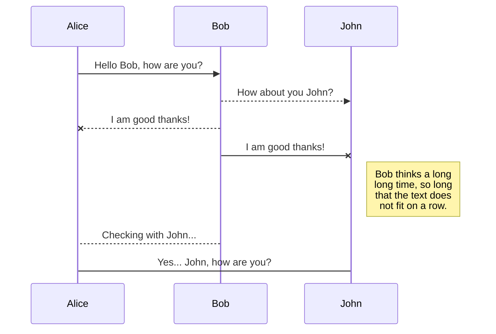
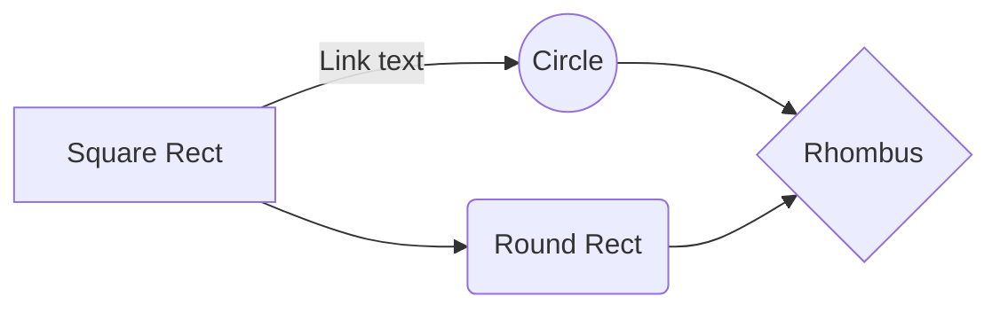

# Bienvenue sur StackEdit!

Salut! Je suis votre premier fichier Markdown dans ** StackEdit ** . Si vous voulez en savoir plus sur StackEdit, vous pouvez me lire. Si vous voulez jouer avec Markdown, vous pouvez me modifier. Une fois que vous avez terminé avec moi, vous pouvez créer de nouveaux fichiers en ouvrant ** l' explorateur de fichiers ** dans le coin gauche de la barre de navigation.

# Fichiers

StackEdit stocke vos fichiers dans votre navigateur, ce qui signifie que tous vos fichiers sont automatiquement enregistrés localement et sont accessibles ** hors ligne! **

## Créer des fichiers et des dossiers

The file explorer is accessible using the button in left corner of the navigation bar. You can create a new file by clicking the **New file** button in the file explorer. You can also create folders by clicking the **New folder** button.

## Switch to another file

All your files and folders are presented as a tree in the file explorer. You can switch from one to another by clicking a file in the tree.

## Rename a file

You can rename the current file by clicking the file name in the navigation bar or by clicking the **Rename** button in the file explorer.

## Delete a file

You can delete the current file by clicking the **Remove** button in the file explorer. The file will be moved into the **Trash** folder and automatically deleted after 7 days of inactivity.

## Export a file

You can export the current file by clicking **Export to disk** in the menu. You can choose to export the file as plain Markdown, as HTML using a Handlebars template or as a PDF.

# Synchronization

Synchronization is one of the biggest features of StackEdit. It enables you to synchronize any file in your workspace with other files stored in your **Google Drive**, your **Dropbox** and your **GitHub** accounts. This allows you to keep writing on other devices, collaborate with people you share the file with, integrate easily into your workflow... The synchronization mechanism takes place every minute in the background, downloading, merging, and uploading file modifications.

There are two types of synchronization and they can complement each other:

- The workspace synchronization will sync all your files, folders and settings automatically. This will allow you to fetch your workspace on any other device.
	> To start syncing your workspace, just sign in with Google in the menu.

- The file synchronization will keep one file of the workspace synced with one or multiple files in **Google Drive**, **Dropbox** or **GitHub**.
	> Before starting to sync files, you must link an account in the **Synchronize** sub-menu.

## Open a file

You can open a file from **Google Drive**, **Dropbox** or **GitHub** by opening the **Synchronize** sub-menu and clicking **Open from**. Once opened in the workspace, any modification in the file will be automatically synced.

## Save a file

Vous pouvez enregistrer n'importe quel fichier de l'espace de travail dans ** Google Drive ** , ** Dropbox ** ou ** GitHub ** en ouvrant le sous-menu ** Synchroniser ** et en cliquant sur ** Enregistrer sur ** . Même si un fichier de l'espace de travail est déjà synchronisé, vous pouvez l'enregistrer dans un autre emplacement. StackEdit peut synchroniser un fichier avec plusieurs emplacements et comptes.

## Synchroniser un fichier

Une fois que votre fichier est lié à un emplacement synchronisé, StackEdit le synchronisera périodiquement en téléchargeant / téléchargeant toute modification. Une fusion sera effectuée si nécessaire et les conflits seront résolus.

Si vous venez de modifier votre fichier et que vous cliquez sur forcer la synchronisation, sur le bouton ** Synchroniser maintenant ** dans la barre de navigation.

> ** Remarque: ** Le bouton ** Synchroniser maintenant ** est désactivé si vous n'avez aucun fichier à synchroniser. 

## Gérer la synchronisation des fichiers

Puisqu'un fichier peut être synchronisé avec plusieurs emplacements, vous pouvez répertorier et gérer les emplacements synchronisés en cliquant sur ** Synchronisation de fichiers ** dans le sous-menu ** Synchroniser ** . Cela vous permet de répertorier et de supprimer les emplacements synchronisés liés à votre fichier.

# Publication

La publication dans StackEdit vous permet de publier facilement vos fichiers en ligne. Une fois que vous êtes satisfait d'un fichier, vous pouvez publier sur différentes plates-formes d'hébergement telles que ** Blogger ** , ** Dropbox ** , ** Gist ** , ** GitHub ** , *                                             * Google Drive ** , * * WordPress ** et ** Zendesk ** . Avec [Modèles de guidons] ( http://handlebarsjs.com/) , vous avez un contrôle total sur ce que vous exportez.

> Avant de commencer à publier, vous devez associer un compte dans le sous-menu ** Publier ** .

## Publier un fichier

Vous pouvez publier votre fichier en ouvrant le sous-menu ** Publier ** et en cliquant sur ** Publier dans ** . Pour certains emplacements, vous pouvez choisir entre les formats suivants:

- Markdown: publier le texte Markdown sur un site internet capable de l'interpréter ( ** GitHub ** par exemple), - HTML: publier le fichier converti en HTML via un template Handlebars (sur un blog par exemple).

## Mettre à jour une publication

After publishing, StackEdit keeps your file linked to that publication which makes it easy for you to re-publish it. Once you have modified your file and you want to update your publication, click on the **Publish now** button in the navigation bar.

> **Note:** The **Publish now** button is disabled if your file has not been published yet.

## Manage file publication

Since one file can be published to multiple locations, you can list and manage publish locations by clicking **File publication** in the **Publish** sub-menu. This allows you to list and remove publication locations that are linked to your file.

# Markdown extensions

StackEdit extends the standard Markdown syntax by adding extra **Markdown extensions**, providing you with some nice features.

> **ProTip:** You can disable any **Markdown extension** in the **File properties** dialog.

## SmartyPants

SmartyPants converts ASCII punctuation characters into "smart" typographic punctuation HTML entities. For example:

|                |ASCII                          |HTML                         |
|----------------|-------------------------------|-----------------------------|
|Single backticks|`'Isn't this fun?'`            |'Isn't this fun?'            |
|Quotes          |`"Isn't this fun?"`            |"Isn't this fun?"            |
|Dashes          |`-- is en-dash, --- is em-dash`|-- is en-dash, --- is em-dash|

## KaTeX

You can render LaTeX mathematical expressions using [KaTeX](https://khan.github.io/KaTeX/):

The *Gamma function* satisfying $\Gamma(n) = (n-1)!\quad\forall n\in\mathbb N$ is via the Euler integral

$$
\Gamma(z) = \int_0^\infty t^{z-1}e^{-t}dt\,.
$$

> You can find more information about **LaTeX** mathematical expressions [here](http://meta.math.stackexchange.com/questions/5020/mathjax-basic-tutorial-and-quick-reference).

## UML diagrams

You can render UML diagrams using [Mermaid](https://mermaidjs.github.io/). For example, this will produce a sequence diagram:

And this will produce a flow chart:

<!--stackedit_data:
eyJoaXN0b3J5IjpbMTEwMjQ3ODA3MV19
-->